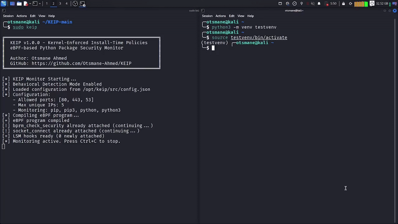
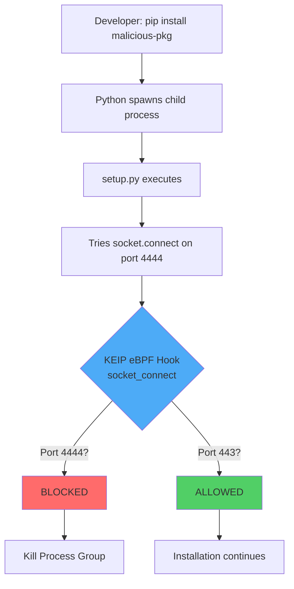

# KEIP - Kernel-Enforced Install-Time Policies

<div align="center">

**Real-time malware protection for Python package installations using eBPF**

[](LICENSE)
[](https://www.python.org/)
[](https://kernel.org/)
[](https://ebpf.io/)

[Features](#features) • [How it works](#how-it-works) • [Installation](#installation) • [Usage](#usage) • [Documentation](#documentation)

</div>

---

## What is KEIP?


KEIP sits between `pip install` and your kernel. It watches every network connection a package makes during installation and kills anything that looks suspicious. No signatures, no databases, just behavior.

If a package tries to phone home on a weird port or talk to a dozen different servers, KEIP shuts it down before it can do any damage.

### Why does this matter?

When you run `pip install some-package`, that package can run arbitrary code through its `setup.py`. This is how attackers steal credentials, open backdoors, and exfiltrate data. It happens more often than you'd think.

The tools we have today don't really solve this:
- Static scanners miss obfuscated code (and about half of malicious packages use obfuscation)
- Sandboxes add 2-5 seconds per install, which kills CI/CD performance
- Runtime monitoring only kicks in after installation is done, which is too late
- Signature databases are useless against new attacks

KEIP takes a different approach. It hooks into the kernel using eBPF and enforces security policies during installation, in real time, at a level that can't be bypassed from userspace.

---

## Features

| Feature | Description |
|---------|-------------|
| Kernel-level enforcement | eBPF LSM hooks block threats at the source, can't be bypassed |
| Install-time protection | Targets the install phase, where 56% of supply chain attacks happen |
| Behavioral detection | Watches what packages do, not what they look like |
| CI/CD ready | Under 50ms overhead, won't slow down your pipeline |
| Low false positives | Legitimate packages (PyPI CDN, GitHub) go through just fine |
| Real-time monitoring | See every connection a package makes as it happens |
| Process termination | Kills the entire process group, not just one connection |

---

## How it works

KEIP uses three rules to decide if a package is behaving normally or not.

### Architecture flow



### Rule 1: Port trap

Legitimate packages only need ports 80, 443, and 53 (HTTP, HTTPS, DNS). If a package tries to connect on port 22 (SSH), 4444 (common reverse shell), 6379 (Redis), or anything else unusual, that's a red flag.

```
pip install malicious-package
  setup.py tries socket.connect("attacker.com", 4444)
    KEIP intercepts at kernel level
      Process killed, installation stopped
```

### Rule 2: Connection counter

A normal package talks to maybe 2-4 servers during install (PyPI CDN, maybe GitHub). Malware tends to scan or try multiple C2 servers. KEIP blocks any package that contacts more than 5 unique IPs.

### Rule 3: Data exfiltration detection (coming soon)

Normal packages download a lot and upload very little. Malware does the opposite, it reads your SSH keys and environment variables and sends them somewhere. KEIP will flag any installation where the upload/download ratio looks off.

---

## Requirements

- Linux with kernel 5.7 or newer (needs LSM BPF support)
- BTF (BPF Type Format) enabled in the kernel
- Root access (eBPF needs `CAP_BPF` and `CAP_SYS_ADMIN`)

Tested on:
- Debian 12
- Ubuntu 22.04+
- Kali Linux
- Fedora 38+

If you're on a different distro, check your kernel version with `uname -r`.

---

## Installation

```bash
git clone https://github.com/Otsmane-Ahmed/KEIP.git
cd KEIP
chmod +x *.sh
./check_compat.sh
sudo ./setup.sh
sudo ./install.sh
```

That's it. Here's what each step does:

**`./check_compat.sh`** checks if your kernel and system support eBPF LSM hooks.

**`sudo ./setup.sh`** installs dependencies: clang, llvm, bpfcc, kernel headers, and sets up a Python virtual environment.

**`sudo ./install.sh`** copies KEIP to `/opt/keip` and creates a global `keip` command in `/usr/local/bin`.

To verify everything is in place:

```bash
which keip
# should output: /usr/local/bin/keip
```

---

## Usage

### Starting the monitor

If you installed KEIP system-wide via `./install.sh`, it uses Linux capabilities (`CAP_BPF`) to run without root.

```bash
keip
```

You should see:

```
╔═════════════════════════════════════════════════════════╗
║  KEIP v1.0.0 - Kernel-Enforced Install-Time Policies    ║
║  eBPF-based Python Package Security Monitor             ║
║                                                         ║
║  Author: Otsmane Ahmed                                  ║
║  GitHub: https://github.com/Otsmane-Ahmed/KEIP          ║
╚═════════════════════════════════════════════════════════╝

[*] KEIP Monitor Starting...
[*] Behavioral Detection Mode Enabled
[*] Configuration:
    - Allowed ports: [80, 443, 53]
    - Max unique IPs: 5
    - Monitoring: pip, pip3, python, python3
[+] eBPF program compiled
[+] LSM hooks ready
[*] Monitoring active. Press Ctrl+C to stop.
```

### Testing with a safe package

Open another terminal and install something legitimate. KEIP monitors all pip and python processes system-wide, so it doesn't matter if you're using the virtual environment that `setup.sh` created, your own venv, or installing directly on the system. It will pick it up either way.

```bash
pip install requests
```

KEIP will show:

```
[ALLOWED] PID 12345 -> 151.101.64.223:443
[ALLOWED] PID 12345 -> 151.101.128.223:443
```

Normal traffic, normal ports, no problem.

### What a blocked install looks like

If a package tries something sketchy:

```
[BLOCKED] PID 12346 -> 203.0.113.45:22
  Reason: Suspicious port (not 80/443/53)
  [!] Terminating process group 12346...
```

The package gets killed and the install fails.

### Installing packages with .pth file auditing

KEIP can also audit `pip install` for malicious `.pth` file planting. A `.pth` file dropped into `site-packages` will be executed by Python every time the interpreter starts, even if you never import the package.

```bash
keip install requests
```

KEIP will:
1. Snapshot all `.pth` files in your `site-packages` directories
2. Run `pip install` normally
3. Compare the before/after snapshots
4. Alert you if any new `.pth` files with executable code were planted

```
[KEIP .pth AUDIT] Scanning site-packages before install...
  Monitoring: /usr/lib/python3/dist-packages
  Found 3 existing .pth file(s)
[KEIP .pth AUDIT] Running pip install...
[KEIP .pth AUDIT] Scanning site-packages after install...
[KEIP .pth AUDIT] No new or modified .pth files detected. All clear.
```

### Quiet mode

For CI/CD pipelines where you don't need the banner and info messages:

```bash
keip --quiet
```

### Running without system-wide install

If you just want to test it locally:

```bash
cd KEIP
source keip-env/bin/activate
# Note: running locally bypasses the system-wide capabilities, so sudo is still required here
sudo ./run_keip.sh
```

---

## Configuration

You can tweak the detection rules by editing `/opt/keip/src/config.json`:

```json
{
    "behavioral_detection": {
        "allowed_ports": [80, 443, 53],
        "max_unique_ips": 5,
        "max_send_bytes": 20480,
        "send_receive_ratio": 0.1
    },
    "monitoring": {
        "process_names": ["pip", "pip3", "python", "python3"]
    }
}
```

| Option | What it does | Default |
|--------|-------------|---------|
| `allowed_ports` | Which ports are considered safe | `[80, 443, 53]` |
| `max_unique_ips` | How many unique IPs before blocking | `5` |
| `max_send_bytes` | Max outbound data during install | `20480` (20KB) |
| `send_receive_ratio` | Max upload-to-download ratio | `0.1` (10%) |

Restart KEIP after making changes.

---

## Uninstallation

```bash
cd KEIP
sudo ./uninstall.sh
```

This cleans up everything: the global `keip` command, files in `/opt/keip`, and the local virtual environment.

To also remove the project directory:

```bash
cd ..
rm -rf KEIP/
```

---

## Documentation

### Architecture

```
┌─────────────────────────────────────────────────────────┐
│                    User space                           │
│  Developer runs: pip install package                    │
└────────────────────┬────────────────────────────────────┘
                     │
                     ▼
┌─────────────────────────────────────────────────────────┐
│                 KEIP monitor (Python)                   │
│  Loads eBPF program, attaches LSM hooks,                │
│  processes events from the kernel                       │
└────────────────────┬────────────────────────────────────┘
                     │
                     ▼
┌─────────────────────────────────────────────────────────┐
│              Kernel space (eBPF/LSM)                    │
│                                                         │
│  bprm_check_security                                    │
│    Tracks pip/python process execution                  │
│                                                         │
│  socket_connect                                         │
│    Intercepts network connections                       │
│    Checks port, IP count, send/recv ratio               │
│    Returns ALLOW or BLOCK (-EPERM)                      │
└─────────────────────────────────────────────────────────┘
```

### Project structure

```
KEIP/
├── src/
│   ├── keip_pip_monitor.py    # main eBPF monitor
│   ├── pth_audit.py           # .pth file planting detector
│   └── config.json            # detection rules
├── check_compat.sh            # system check
├── setup.sh                   # dependency installer
├── install.sh                 # system-wide installer
├── run_keip.sh               # local runner
├── uninstall.sh              # clean uninstaller
└── README.md
```

---

## How it compares to other tools

| Tool | Approach | When it acts | Can it block? | Handles obfuscation? |
|------|----------|--------------|---------------|---------------------|
| KEIP | Behavioral (eBPF) | During install | Yes | Yes |
| Bandit | Static analysis | Before install | No | No |
| pip-audit | Signature database | Before install | No | No |
| Falco | Runtime monitoring | After install | No | Yes |
| gVisor | Sandboxing | Runtime | Yes | Partially |
| GoLeash | Behavioral (eBPF) | Runtime | Yes | Yes |

Most tools either act too early (static analysis, which misses obfuscation) or too late (runtime monitoring, which means the malware already ran). KEIP sits right at the install step, where over half of supply chain attacks actually happen. And unlike GoLeash, which does something similar for Go, KEIP is built for the Python ecosystem.

---

## Troubleshooting

**"Requirements or Capabilities missing"** - The eBPF monitor requires `CAP_BPF`. If you are running locally without full installation, you must use `sudo keip` or `sudo ./run_keip.sh`. The full installation via `install.sh` handles capabilities automatically.

**"LSM BPF not supported"** - Your kernel is either too old or doesn't have BPF LSM enabled. Check with:
```bash
uname -r                              # needs to be >= 5.7
cat /sys/kernel/security/lsm          # should contain "bpf"
```

**"bcc module not found"** - Run `sudo apt install python3-bpfcc` or re-run `sudo ./setup.sh`.

**"LSM hook already attached"** - A previous KEIP session didn't clean up properly. Kill it with `sudo pkill -f keip_pip_monitor` or just reboot.

**Legitimate package got blocked** - Some packages like PyTorch or TensorFlow download from their own CDNs. For now, you'd need to temporarily stop KEIP for those installs. Proper whitelist support is planned.

---

## Contributing

If you want to help out:
- Found a bug? Open an issue with your system info and the error output
- Have an idea? Suggest new detection rules or whitelist improvements
- Want to code? PRs are welcome for anything from docs to new features
- Have access to malware samples? Test results are always useful

```bash
git clone https://github.com/Otsmane-Ahmed/KEIP.git
cd KEIP
sudo ./setup.sh
sudo python3 src/keip_pip_monitor.py
```

---

## License

MIT License - see [LICENSE](LICENSE) for details.

---

## Acknowledgments

- The eBPF community and the BCC toolkit
- Backstabber's Knife Collection (DIMVA 2020) and GoLeash (2025) research papers
- Everyone who reports and documents Python supply chain attacks

---

## Contact

Otsmane Ahmed  
GitHub: [@Otsmane-Ahmed](https://github.com/Otsmane-Ahmed)  
Project: [github.com/Otsmane-Ahmed/KEIP](https://github.com/Otsmane-Ahmed/KEIP)

If KEIP helped you out, a star on the repo would be appreciated.

---

<div align="center">

Made with love by Otsmane Ahmed

</div>
